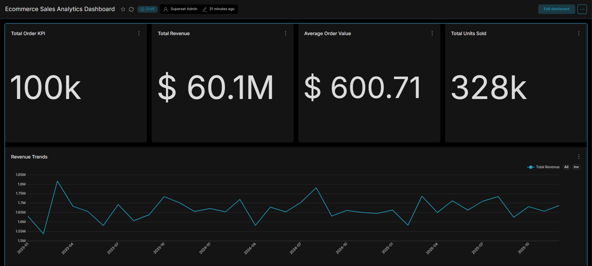
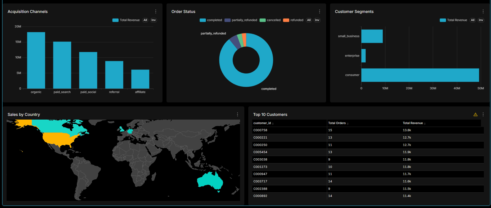

# E-Commerce Sales Analytics & Dashboard

This is an end-to-end Data Engineering and Analytics project that processes raw E-Commerce sales data using **DuckDB** and visualizes the insights using a custom-built **Apache Superset** container.

## 🚀 Architecture & Tech Stack
*   **Database Engine:** DuckDB (High-performance analytical SQL engine)
*   **Data Format:** Parquet (Columnar storage)
*   **Data Loading & Processing:** Python
*   **Visualization / BI:** Apache Superset (running via Docker)

## 📁 Project Structure
```text
.
├── data/
│   ├── ecommerce-sales-v1.0.0-analysis.parquet   # Raw analytical dataset
│   └── ecommerce_data.db                         # DuckDB persistent database
├── notebook/
│   └── ecommerce_analysis.ipynb                  # Exploratory Data Analysis
├── sql/
│   └── analysis.sql                              # Core analytical SQL queries
├── superset/
│   ├── Dockerfile                                # Custom Superset image config
│   └── docker-compose.yml                        # Superset deployment config
├── load_data.py                                  # ETL script to load Parquet to DuckDB
└── requirements.txt                              # Python dependencies
```

## 📊 Dashboard Highlights
The Apache Superset dashboard provides a comprehensive "drill-down" view of the business:
1.  **Executive KPIs:** Total Orders, Net Revenue, Average Order Value, Total Units Sold.
2.  **Revenue Trends:** A time-series analysis mapping month-over-month revenue growth.
3.  **Categorical Breakdowns:** Order status distribution, acquisition channels, and customer segments.
4.  **Granular Details:** A global geographic heatmap and a Top 10 Customers ranking table.





## 🛠️ Setup & Installation

### 1. Python Environment Setup
Install the required Python packages for data processing and notebook exploration:
```bash
pip install -r requirements.txt
```

### 2. Load Data into DuckDB
Run the Python ETL script to ingest the Parquet file into a persistent DuckDB database, ensuring all columns are cast to the correct data types for BI analysis:
```bash
python load_data.py
```

### 3. Deploy Apache Superset
This project uses a custom Docker container to inject the `duckdb-engine` driver directly into Superset's virtual environment. Ensure you have Docker Desktop installed and running.

Navigate to the `superset` directory and start the services:
```bash
cd superset
docker compose up -d --build
```

### 4. Connect Superset to DuckDB
1. Open your browser and navigate to `http://localhost:8088`.
2. Login with Username: `admin` / Password: `admin`
3. Go to **Settings > Database Connections > + Database**.
4. Select **DuckDB** (or **Other**) and enter the SQLAlchemy URI:
   ```text
   duckdb:////app/data/ecommerce_data.db
   ```
5. Click **Test Connection** and then connect! You can now use the `clean_orders` table to build your charts.
